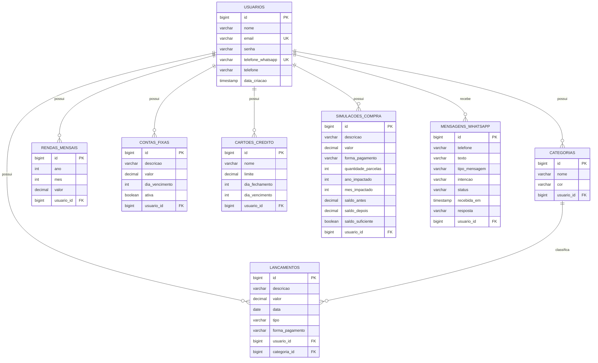

# Diagrama de Banco de Dados

```mermaid
erDiagram
    USUARIOS {
        bigint id PK
        varchar nome
        varchar email UK
        varchar senha
        varchar telefone_whatsapp UK
        varchar telefone
        timestamp data_criacao
    }

    CATEGORIAS {
        bigint id PK
        varchar nome
        varchar cor
        bigint usuario_id FK
    }

    LANCAMENTOS {
        bigint id PK
        varchar descricao
        decimal valor
        date data
        varchar tipo
        varchar forma_pagamento
        bigint usuario_id FK
        bigint categoria_id FK
    }

    RENDAS_MENSAIS {
        bigint id PK
        int ano
        int mes
        decimal valor
        bigint usuario_id FK
    }

    CONTAS_FIXAS {
        bigint id PK
        varchar descricao
        decimal valor
        int dia_vencimento
        boolean ativa
        bigint usuario_id FK
    }

    CARTOES_CREDITO {
        bigint id PK
        varchar nome
        decimal limite
        int dia_fechamento
        int dia_vencimento
        bigint usuario_id FK
    }

    SIMULACOES_COMPRA {
        bigint id PK
        varchar descricao
        decimal valor
        varchar forma_pagamento
        int quantidade_parcelas
        int ano_impactado
        int mes_impactado
        decimal saldo_antes
        decimal saldo_depois
        boolean saldo_suficiente
        bigint usuario_id FK
    }

    MENSAGENS_WHATSAPP {
        bigint id PK
        varchar telefone
        varchar texto
        varchar tipo_mensagem
        varchar intencao
        varchar status
        timestamp recebida_em
        varchar resposta
        bigint usuario_id FK
    }

    USUARIOS ||--o{ CATEGORIAS : possui
    USUARIOS ||--o{ LANCAMENTOS : possui
    USUARIOS ||--o{ RENDAS_MENSAIS : possui
    USUARIOS ||--o{ CONTAS_FIXAS : possui
    USUARIOS ||--o{ CARTOES_CREDITO : possui
    USUARIOS ||--o{ SIMULACOES_COMPRA : possui
    USUARIOS ||--o{ MENSAGENS_WHATSAPP : recebe
    CATEGORIAS ||--o{ LANCAMENTOS : classifica
```
