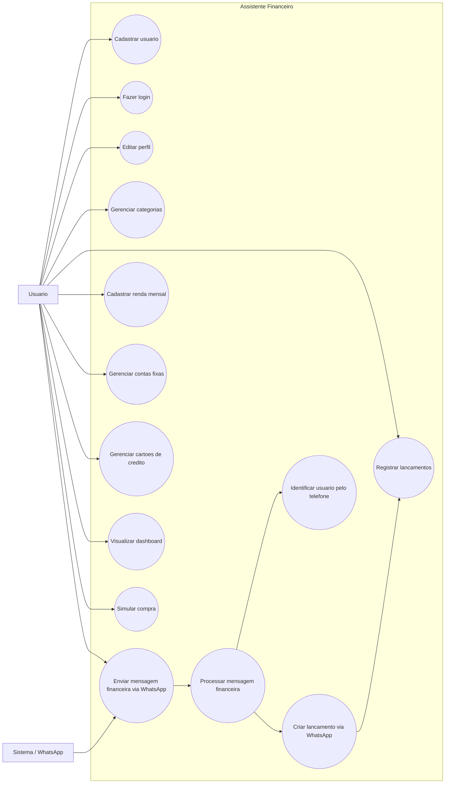

# Diagrama de Caso de Uso

```mermaid
flowchart LR
    usuario["Usuario"]
    whatsapp["Sistema / WhatsApp"]

    subgraph sistema["Assistente Financeiro"]
        cadastrarUsuario(("Cadastrar usuario"))
        fazerLogin(("Fazer login"))
        editarPerfil(("Editar perfil"))
        gerenciarCategorias(("Gerenciar categorias"))
        registrarLancamentos(("Registrar lancamentos"))
        cadastrarRendaMensal(("Cadastrar renda mensal"))
        gerenciarContasFixas(("Gerenciar contas fixas"))
        gerenciarCartoes(("Gerenciar cartoes de credito"))
        visualizarDashboard(("Visualizar dashboard"))
        simularCompra(("Simular compra"))
        enviarMensagemWhatsapp(("Enviar mensagem financeira via WhatsApp"))
        processarMensagem(("Processar mensagem financeira"))
        identificarUsuario(("Identificar usuario pelo telefone"))
        criarLancamentoWhatsapp(("Criar lancamento via WhatsApp"))
    end

    usuario --> cadastrarUsuario
    usuario --> fazerLogin
    usuario --> editarPerfil
    usuario --> gerenciarCategorias
    usuario --> registrarLancamentos
    usuario --> cadastrarRendaMensal
    usuario --> gerenciarContasFixas
    usuario --> gerenciarCartoes
    usuario --> visualizarDashboard
    usuario --> simularCompra
    usuario --> enviarMensagemWhatsapp

    whatsapp --> enviarMensagemWhatsapp
    enviarMensagemWhatsapp --> processarMensagem
    processarMensagem --> identificarUsuario
    processarMensagem --> criarLancamentoWhatsapp
    criarLancamentoWhatsapp --> registrarLancamentos
```
