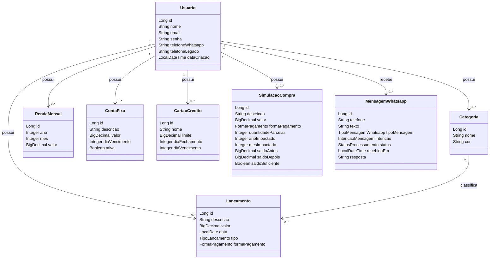

# Diagrama de Classes

```mermaid
classDiagram
    class Usuario {
        Long id
        String nome
        String email
        String senha
        String telefoneWhatsapp
        String telefoneLegado
        LocalDateTime dataCriacao
    }

    class Categoria {
        Long id
        String nome
        String cor
    }

    class Lancamento {
        Long id
        String descricao
        BigDecimal valor
        LocalDate data
        TipoLancamento tipo
        FormaPagamento formaPagamento
    }

    class RendaMensal {
        Long id
        Integer ano
        Integer mes
        BigDecimal valor
    }

    class ContaFixa {
        Long id
        String descricao
        BigDecimal valor
        Integer diaVencimento
        Boolean ativa
    }

    class CartaoCredito {
        Long id
        String nome
        BigDecimal limite
        Integer diaFechamento
        Integer diaVencimento
    }

    class SimulacaoCompra {
        Long id
        String descricao
        BigDecimal valor
        FormaPagamento formaPagamento
        Integer quantidadeParcelas
        Integer anoImpactado
        Integer mesImpactado
        BigDecimal saldoAntes
        BigDecimal saldoDepois
        Boolean saldoSuficiente
    }

    class MensagemWhatsapp {
        Long id
        String telefone
        String texto
        TipoMensagemWhatsapp tipoMensagem
        IntencaoMensagem intencao
        StatusProcessamento status
        LocalDateTime recebidaEm
        String resposta
    }

    Usuario "1" --> "0..*" Categoria : possui
    Usuario "1" --> "0..*" Lancamento : possui
    Usuario "1" --> "0..*" RendaMensal : possui
    Usuario "1" --> "0..*" ContaFixa : possui
    Usuario "1" --> "0..*" CartaoCredito : possui
    Usuario "1" --> "0..*" SimulacaoCompra : possui
    Usuario "1" --> "0..*" MensagemWhatsapp : recebe
    Categoria "1" --> "0..*" Lancamento : classifica
```
