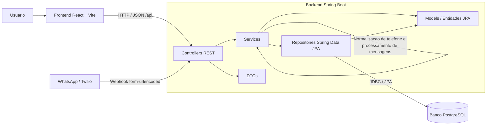

# Diagrama de Componentes

```mermaid
flowchart LR
    usuario["Usuario"]
    twilio["WhatsApp / Twilio"]
    frontend["Frontend React + Vite"]

    subgraph backend["Backend Spring Boot"]
        controllers["Controllers REST"]
        services["Services"]
        repositories["Repositories Spring Data JPA"]
        dtos["DTOs"]
        models["Models / Entidades JPA"]
    end

    banco[("Banco PostgreSQL")]

    usuario --> frontend
    frontend -->|"HTTP / JSON /api"| controllers
    twilio -->|"Webhook form-urlencoded"| controllers

    controllers --> dtos
    controllers --> services
    services --> models
    services --> repositories
    repositories --> models
    repositories -->|"JDBC / JPA"| banco

    services -->|"Normalizacao de telefone e processamento de mensagens"| services
```
